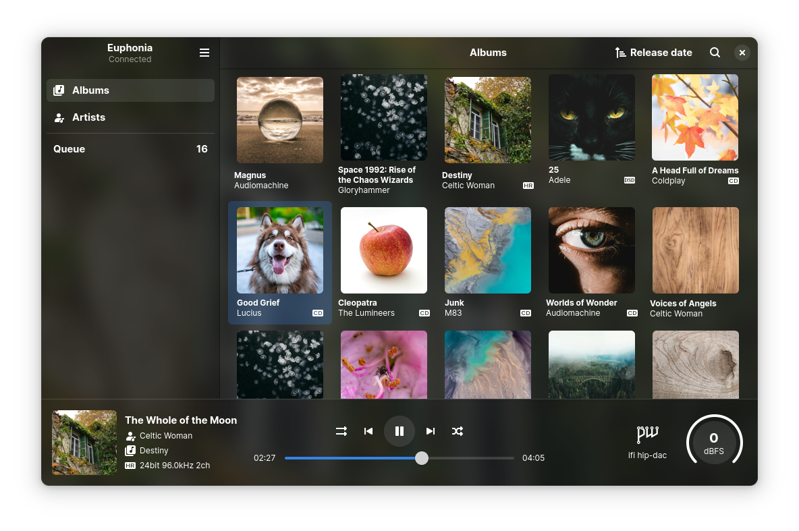
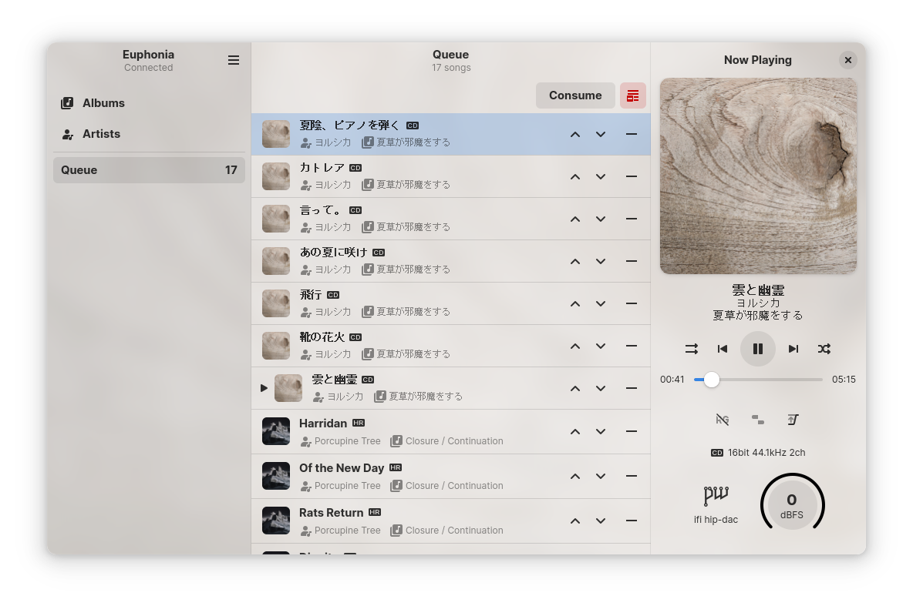
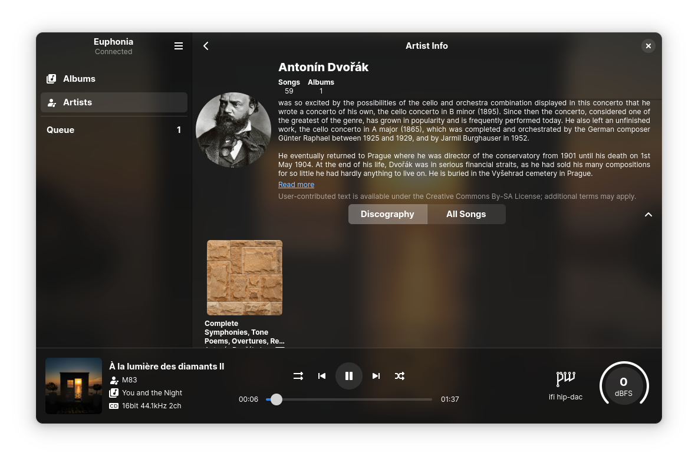
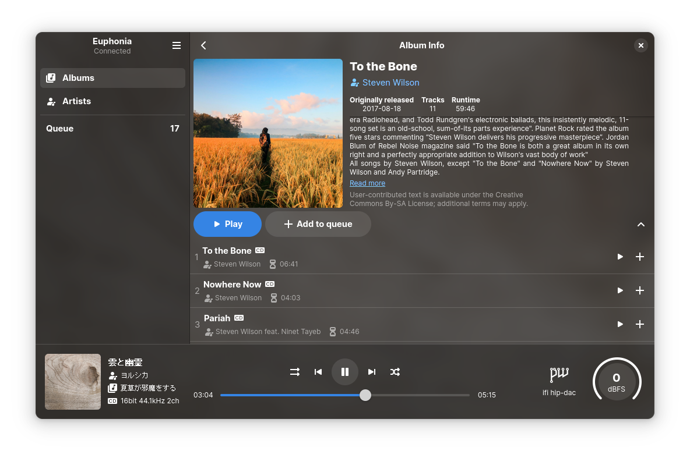

# Euphonica

An MPD frontend with delusions of grandeur.

## Features
- GTK4 Libadwaita UI for most MPD features, from basic things like playback controls, queue reordering and ReplayGain to things like output control, crossfade and MixRamp configuration
- Audio quality indicators (lossy, lossless, hi-res, DSD) for individual songs as well as albums & detailed format printout
- Browse your library by album or artist, with browsing by folder, genre and other criteria in the works
- Sort albums by name, AlbumArtist or release date (provided you have the tags)
- Asynchronous search for large collections
- Configurable multi-artist tag syntax, works with anything you throw at it (in other words, your artist tags can be pretty messy and Euphonica will still be able to correctly split them into individual artists for the Artist View)
- Performant album art fetching & display (cached with Stretto)
- Background blur effect
- Automatically fetch album arts & artist avatars from external sources (currently supports Last.fm and MusicBrainz)
- Album wikis & artist bios are supported too
- All externally-acquired metadata are cached locally & persisted on disk to avoid needless API calls
- Volume knob with dBFS readout support ('cuz why not?)
- MPRIS support (can be disabled if you're running `mpdris2` instead)
- User-friendly configuration UI & GSettings backend
- Written in Rust so my dumb code can still be quick :)

## Screenshots

TODO: Update to reflect the recent name change :)

- Album View in dark mode[^1]
  

- Queue View in light mode[^1]
  

- Artist bio as fetched from Last.fm[^2]
  

- Album wiki as fetched from Last.fm[^1][^2]
  


[^1]: Actual album arts have been replaced with random pictures from [Pexels](https://www.pexels.com/). All credits go to the original photographers.
[^2]: Artist bios and album wikis are user-contributed and licensed by Last.fm under CC-BY-SA.

## Build

Euphonica is developed on, and so far has only been tested on Arch Linux (btw).

1. Make sure you have these dependencies installed beforehand:
  - gtk4 >= 4.16
  - libadwaita >= 1.6
  - rustup >= 1.27
  - meson >= 1.5
  - mpd >= 0.21 (Euphonica relies on the new filter syntax)

2. Init build folder
  ```bash
  cd /path/to/where/you/cloned/this/repo/euphonica
  meson setup build --buildtype=release
  ```

3. Compile & install (will require root privileges)
  ```bash
  cd build
  meson install
  ```
Flatpak & AUR releases are also planned.

## Known issues

- On systems with NVIDIA GPUs, the blurred background effect may become laggy at large window sizes even if using small blur radii. This seems to be a problem with the new `vulkan` GSK renderer (default since GTK 4.15).
  - A temporary workaround is to force usage of the `ngl` (recommended) or `gl` renderer. For example, you can launch Euphonia as `GSK_RENDERER=ngl euphonia`. 

## TODO
- Password support
- Browse by folder
- Browse by genre
- Realtime lyrics fetching
- Library management operations such as tag editing (will require access to the files themselves) 
- An "All tracks" page with advanced, freeform querying to take full advantage of MPD v0.21+'s new query syntax
